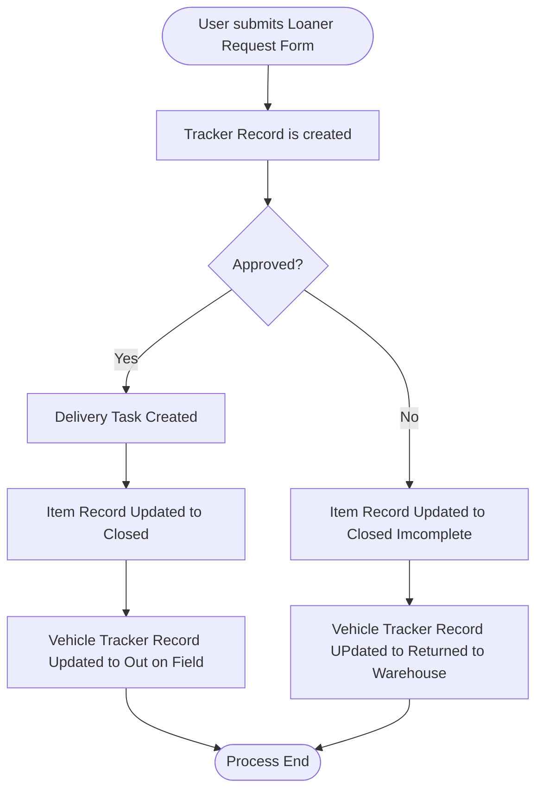
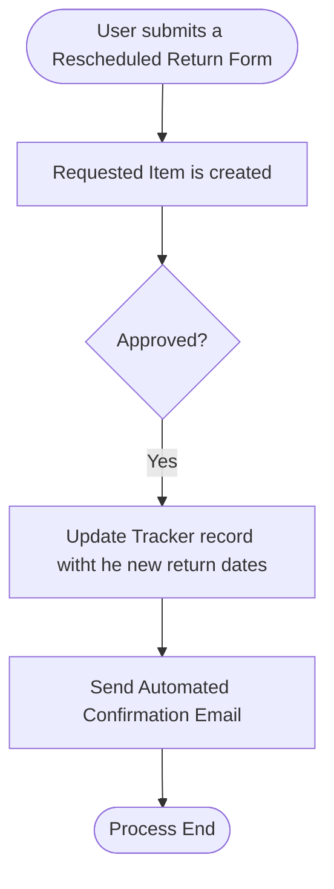

# Project: ServiceNow Loaner Vehicle Request & Inventory Management System

## Overview
**Problem:** Operation faves the following challenges managing loaner vehicle reuests:
- Manual process via email leads to confusing and lost requests
- No visisbility on vehicle availbility or loction status
- Double-booking incidents due to lack of centralized tracking
- Inefficient workflows

**Solution:** Developed a custom scoped ServiceNow application to automate the lifecycle of vehicle requests, approvals, and inventory tracking.
**Core Capabilities:**
- Automated Request Workflow: Service Catalog-driven requests with approval routing
- Real-Time Inventory Tracking: lie vehcle availability and status updates
- Maintenance Managemet: Servicing ticket system with repair tracking
- Compliance & Audit; compllete audit trail with status hitsory and activity logs

## Data Model Design
Three core tables and proper referential integrity:

1. Loaner Vehicle Catalog (Masster Data)
   * Vehicle inventory management
   * Status tracking: Available, Unavailable, Decommissioned
   * Vehicle Details: Make, Model, Year, Description
   * Vehicle images for visual identification
     
2. Vehicle Tracker (Transsaction Records)
   * Request to vehicle assignment mapping
   * Multi-stge status workflow:
         Pending Release -> Out on Field -> Returned for Inspection -> Returned to Warehouse
   * Date coordination
   * Activity logging    
   
3. Vehicle Servicing (Maintenance Records)
   * Service ticket management
   * repair work traacking
   * Vehicle condition documentation
   * Integration with vehicle tracker for status synchronization
  
## Relationships
```
Loaner Vehicle Catalog (1) ─── (M) Vehicle Tracker
                       ↓
                       └────────── (M) Vehicle Servicing
                       
Vehicle Tracker (1) ─────────── (M) Vehicle Servicing
```
## Key Feature Implemented

### Security & Access Control
 * Role-Based Access: custom `lva-user` role for standard users, separate role for servicing team
 * Scoped Application: preventing conflicts with other applications
 * Field-Level Security: Read-only and mandatory field enforcement via UI Policies

### Service Catalog Integration
**Request Loaner Vehicle** catalog item with variable sets:
 * Auto-populated requestor information
 * Dynamic vehicle selection (showing only available vehicles)
 * Date range validation (request date, return date)
 * Multi-line text fields for delivery instructions and special requests

### Workflow auttomation (Flow Designer)
1. **Trigger:** service catalog item submission
2. **Auto-Create:** Vehicle Tracker record with catalog data
3. **Approval Stage:** Route to Loaner Vehicle Approver group
4. **Task Creation:** generate delivery task for Vehicle Delivery Group on approval
5. **Closure:** auto-close RITM when delivery task completes

**Additional Automation:**
 * **Status:** automated state transition across related tables
 * **Notification System:** email alerts for key events
 * **Data Validation:** business rules preventing double-booking
 * **Client Scripts:** auto-populate requestor data, validate date ranges

### Usser Interface Components
 * **Service Portal Interface:**
     * user-friendly catalog item
     * public portal wwidget displaying available vehicles
     * mobile respponsive design
 * **Admin Console:**  list views with custom filters
 * **Form Layouts:** sections for delivery details, return inspection, and activity
 * **Related Lists:** cross--table visibility (vehicles -> trackers -> servicing)

### Dynamic Form Behavior (UI Policies)
Conditional field requirements based oon vehicle status:
 * **Pending Release/ Out on Field:** enforces `assigned to`, `location`, `dates`
 * **Returned for Inspection:** enables `return date`, `condition`, `notes`

### Custom Actions (UI Actions)
Server-side buttons for streamlined operations:
 * **Return to Warehouse:** completes vehicle cycle when inspection passes
 * **Send to Repair:** createsservicing ticket when repairs needed
 * display messages based on status and user role

~~~~~~~~~~~~~~~~~~~~~~~~~~~~~~~~~~~~~~~~~~~~~~~~~~~~~~~~~~~~~~~~~~~~~~~~~~~~~~~~~~~~~~~~~~~~~~~~~~~~~~~~~
**Loaner Vehicle Request Flow**


```mermaid
flowchart TD
    Start([User submits Loaner Request Form]) --> Task1[Tracker Record is created]
    Task1 --> Decision{Approved?}
    Decision -- Yes --> Event1a[Delivery Task Created]
    Event1a --> Event2a[Item Record Updated to Closed]
    Event2a --> Event3a[Vehicle Tracker Record Updated to Out on Field]
    Event3a --> End([Process End])
    Decision -- No --> Event1b[Item Record Updated to Closed Imcomplete]
    Event1b --> Event2b[Vehicle Tracker Record UPdated to Returned to Warehouse]
    Event2b --> End([Process End])
```

**Rescheduled Return Loaner Vehicle Flow**


```mermaid
flowchart TD
    Start([User submits a Rescheduled Return Form]) --> Task1[Requested Item is created]
    Task1 --> Decision{Approved?}
    Decision -- Yes --> Event1[Update Tracker record witht he new return dates]
    Event1 --> Event2[Send Automated Confirmation Email]
    Event2 --> End1([Process End])
```
