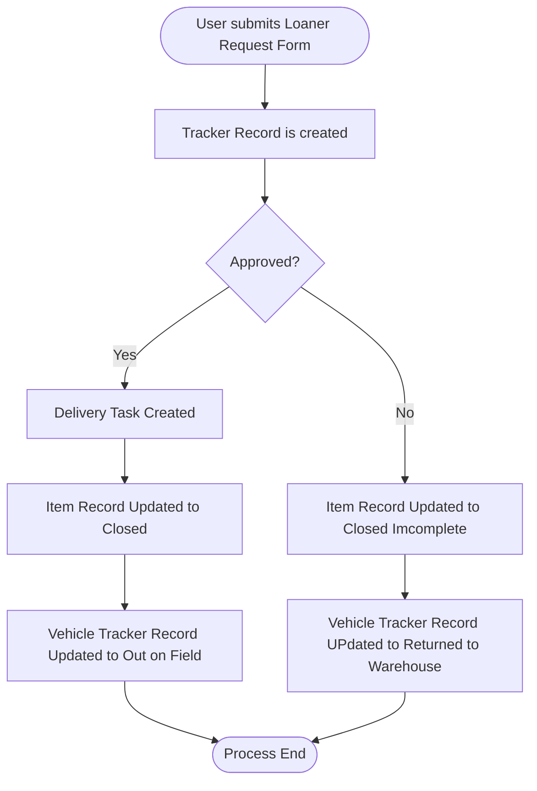
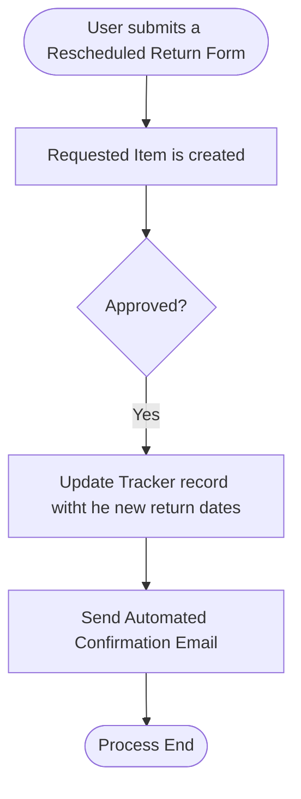

# Project: ServiceNow Loan App

## Overview
**Problem:** The manualprocess for requesting a vehicle process on emails and spreadsheets was ineffcient, prone to errors and no real time visibility into the inventory and request status.

**Solution:** Developed a custom scoped ServiceNow application to automate the lifecycle of vehicle requests, approvals, and inventory tracking.

## Process Analysis & Design
I mapped two core business process to define the system's logic:

**Loaner Vehicle Request Flow**

** Rescheduled Return Loaner Vehicle Flow**

