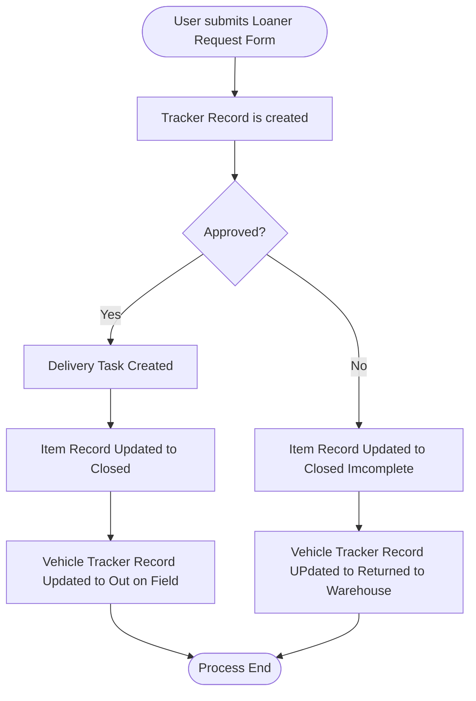
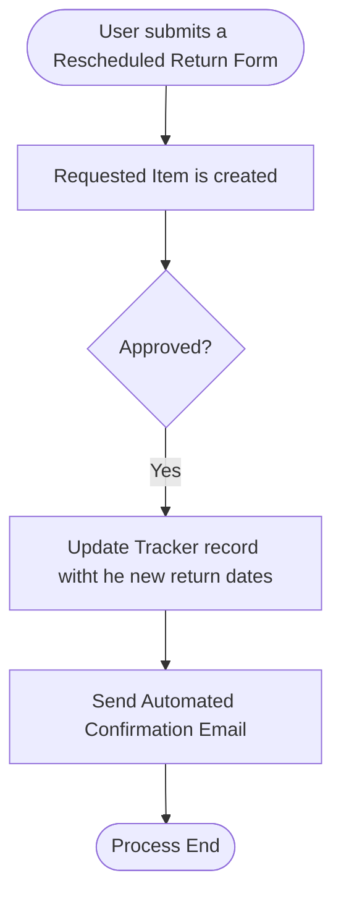

# Technical Architecture

## System Overview
The Loaner Veicle Request & Inventory Management System in a scoped application, the system implements a coplete vehicle lifecycle managment solution rom request throguh servicing.

## Architecture Layers

### 1. Presentation Layer: Service Portal &  Platform UI
 * Service Catalog interface for end users
 * Custom list views
 * Mobile-responsive forms
 * Related lists for cross-record navigation

### 2. Business Logic Layer: ServiceNow Componenets
 * **Flow Designer:** Approval workflows and notifications
 * **Business Rules:** Data validation and automation
    * Prevent double-booking
    * Auto-update statuses
    * Enforce data integrity
 * **UI Policies:** Dynamic form behavior
    * Conditional field requirements
    * Show/hide fields based on status
 * **Client Scripts:** Real-time validation
 * **UI Actions:** Custom operations
    * Return to Warehouse button
    * Send to Repair button

### 3. Data Layer: Database Tables

**Loaner Vehicle Catalog**
```
Fields:
  - number (auto-generated)
  - status (Choice: Available, Unavailable, Decommissioned)
  - vehicle_make (String, required)
  - vehicle_model (String, required)
  - vehicle_year (String, required)
  - vehicle_description (String 1000, required)
  - image (Image attachment)
  - sys_id (Primary Key)
  - sys_created_on, sys_updated_on (Audit)
```

**Vehicle Tracker** 
```
Fields:
  - number (auto-generated)
  - request_number (Reference: sc_req_item, required)
  - vehicle (Reference: loaner_vehicle_catalog, required)
  - vehicle_status (Choice: Pending Release, Out on Field, 
                    Returned for Inspection, Sent for Servicing, 
                    Returned to Warehouse, Decommissioned)
  - tracker_status (Choice: Open, Closed, Cancelled)
  - assigned_to (Reference: sys_user)
  - location (Reference: cmn_location)
  - date_requested (Date)
  - expected_return_date (Date)
  - delivery_information (String 1000)
  - additional_comments (String 1000)
  - actual_return_date (Date)
  - return_vehicle_status (Choice: Returned in Good Condition,
                           Returned with Minor Issues,
                           Returned with Major Issues)
  - return_notes (String 1000)
  - sys_id (Primary Key)
```

**Vehicle Servicing**
```
Fields:
  - number (auto-generated)
  - vehicle_tracker (Reference: vehicle_tracker, required)
  - vehicle (Reference: loaner_vehicle_catalog, required)
  - vehicle_status (Choice: In Service, Returned to Warehouse, Decommissioned)
  - date_sent_for_servicing (Date, required)
  - ticket_status (Choice: Open, Closed)
  - vehicle_issues (String 1000, required)
  - work_performed (String 1000)
  - sys_id (Primary Key)
```

### 4. Integration Layer: ServiceNow Table References
 * `sc_req_item`: Request Item table (ITSM)
 * `sys_user`: User table
 * `cmn_location`: Location table (CMDB)

## Date Flow
**Complete Request to delivery Workflow**
```
1. User submits "Request Loaner Vehicle" catalog item
   ↓
2. ServiceNow creates sc_req_item (RITM) record
   ↓
3. Flow Designer triggers automatically
   ↓
4. Flow Action: Create Vehicle Tracker record
   - Copies all catalog variables to tracker fields
   - Links to RITM via request_number field
   - Sets initial status: "Pending Release"
   ↓
5. Flow Action: Create Approval for Loaner Vehicle Approver Group
   - Waits for approval decision
   ↓
6a. If REJECTED:
    - Update tracker status to "Cancelled"
    - Close RITM
    - Send rejection notification
    
6b. If APPROVED:
    ↓
7. Flow Action: Create Delivery Task
   - Assigned to: Vehicle Delivery Group
   - Contains: Vehicle details, delivery location, requestor info
   ↓
8. Flow waits for delivery task closure
   ↓
9. When delivery task closed:
   - Update tracker status to "Out on Field"
   - Close RITM
   - Send confirmation email to requestor
```

**Request Flow**



**Rescheduled Return Flow**



## Business Logic Details
### Business Rules

**1. Auto-Create Servicing Record**
**Table:** Vehicle Tracker
**When:** After update
**Condition:** `vehicle_status` changes to "sent_to_servicing"
**Action:**
- Create new Vehicle Servicing record
- Copy vehicle reference from tracker
- Set initial servicing status: "In Service"
- Set ticket status: "Open"
- Auto-populate date sent for servicing
- Link back to vehicle tracker

**2. Sync Vehicle Catalog Status**
**Table:** Vehicle Tracker
**When:** After insert/update
**Condition:** `vehicle_status` changes
**Action:**
Status Mapping:
- pending_release → Catalog: unavailable
- out_on_field → Catalog: unavailable  
- returned_for_inspection → Catalog: unavailable
- sent_to_servicing → Catalog: unavailable
- returned_to_warehouse → Catalog: available
- decommissioned → Catalog: decommissioned

**3. Prevent Double Booking**
**Table:** Vehicle Tracker
**When:** Before insert
**Condition:** Always
**Action:**
- Query for existing open trackers with same vehicle
- Check if vehicle_status IN ('Pending Release', 'Out on Field')
- If found: abort with error message
- Ensures one vehicle = one active assignment

### Client Scripts
**1. Auto-Populate Requestor**
**Type:** onLoad
**Field:** `requested_by`
**Action:** Set to current logged-in user (read-only)

**2. Validate Date Range**
**Type:** onChange
**Field:** `date_to_return_the_vehicle`
**Action:***
- Compare with date_needed
- Ensure return date > needed date
- Show error if validation fails
- Clear invalid value

**3. Filter Available Vehicles**
**Type:** onLoad
***Field:** select_the_vehicle_that_you_need
**Action:**
- Add reference qualifier
- Filter: status = 'Available'
- Only show vehicles ready for assignment

## Improvements
**Known Limitations**
 * No automated mileage tracking
 * Manual image upload for vehicles
 * Basic approval workflow (single approver)

**Planned Optimizations**
 * Implement advanced approval routing
 * Add email templates for notifications
 * Create dashboards
 * Integrate calendar for availability

[ <- Back to previous page](/servicenowloan-app.md)
